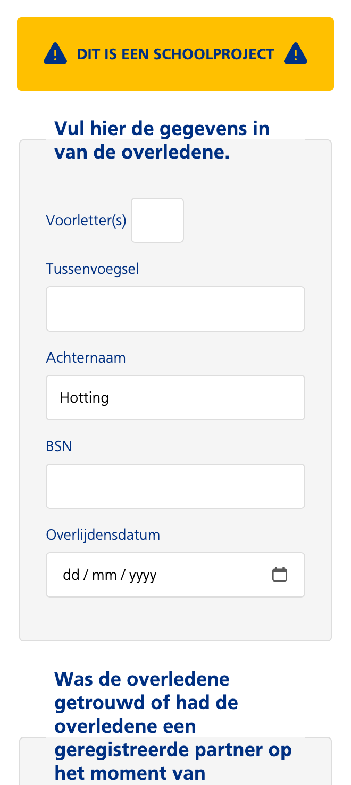

> [!CAUTION]
> DIT IS EEN SCHOOLPROJEC# Sprint 1

## Leerdoelen bij deze opdracht

- CSS Animaties & Keyframes
    - Ik wil complexe CSS animaties en keyframes kunnen ontwerpen, zodat ik interactieve, duidelijke micro-interacties en state-changes kan bouwen.
    - *Reden: Animaties verbeteren de gebruikerservaring en maken interfaces intu�tiever.*

- Responsive & Semantiek
    - Ik wil een toegankelijke en responsive interface bouwen met semantische HTML, goede contrasten en duidelijke navigatie, zodat mijn projecten bruikbaar zijn op elk device.
    - *Reden: Accessibility en responsiveness zorgen voor inclusieve, gebruiksvriendelijke websites.*

## Dag 1

### Wat heb ik gedaan vandaag?

| Activiteit | Duur |
|------------|------|
| Kick-off gehad| 2 uur |
| Begin gemaakt aan de eerste pagina van het formulier| 2 uur |
| Pauze | 1 uur |
| Styling | 2 uur |
| Artikel doornemen | 20 min |

### Wat heb ik geleerd?

* Hoe je een max lengte geeft aan een input field
* Dat een `<input>` dynamisch aanpast op basis van de taal van je browser. Zo stond mijn browser op Engels (US) en was de datum dus mm/dd/yyyy
* Hoe je kan checken of de datum in de toekomst ligt en dat je dit eigenlijk aan de server-side moet doen omdat mensen anders hun eigen datum kunnen manipuleren
* Hoe `<fieldset>` werkt en dat deze altijd een `<legend>` moet hebben

### Weekly Geek

[Link naar artikel](https://tonsky.me/blog/tahoe-icons/)

Visuele ruis: Als alles een icoon heeft, valt niets meer op. Het scannen van teksten wordt moeilijker en trager.

Extreme inconsistentie: Basisacties zoals "Nieuw", "Opslaan" of "Zoeken" hebben in verschillende apps totaal andere iconen, wat verwarrend is.

Slechte metaforen: Veel iconen zijn onbegrijpelijk of gebruiken hetzelfde symbool voor verschillende functies.

Technisch onleesbaar: De iconen zijn te klein voor de hoeveelheid detail die erin zit, en ze zijn niet goed uitgelijnd op de pixels, waardoor ze wazig ogen.

### Wat ga ik morgen doen?

- [x] Progressive disclosure toevoegen
- [x] Styling fixen voor de fieldset figure

---

## Dag 2

### Wat heb ik gedaan vandaag?

| Activiteit | Duur |
|------------|------|
| Styling mooier gemaakt en navigatie toegevoegd| 4 uur |
| Javascript toeveoegen voor progressive disclosure | 3,5 uur |
| Pauze | 30 min |

### Wat heb ik geleerd?

* Hoe je een radiobutton styled door hem weg te halen en de styling op het label uit te voeren
* Dat accessibility belangrijk is bij custom form controls :focus state etc

### Wat ga ik morgen doen?

- [x] CSS (volgende opdracht)

## Feedback (dag 3)

### Positieve punten (+)

- **Styling**: Hele exacte styling, het ziet er erg goed en "clean" uit.
- **Details**: Leuk detail met het icoontje.
- **Logica**: Er is al goed nagedacht over de logica en de werking van het formulier.
- **Creativiteit**: De extra vraag met de upload-optie is heel slim en goed bedacht.

### Verbeterpunten & Vragen (-)

- **Progressive Enhancement (PE)**: De progressive enhancement is nog niet sterk; zonder JavaScript werkt de pagina momenteel niet.
- **Semantiek & Toegankelijkheid**: Denk goed na over de semantiek en toegankelijkheid (A11y). Is hier al specifiek naar gekeken?
- **Prioritering**: Denk goed na over wat echt belangrijk is. Bijvoorbeeld: 'required' velden zijn essentieel voor de belasting/verwerking.
- **Layout & UX**: Maak op desktop meer gebruik van de beschikbare ruimte. Stel velden die verplicht zijn alvast in als required. Hierdoor kun je de lay-out met Progressive Enhancement beter uitdenken.

## Dag 4

### Wat heb ik gedaan vandaag?

| Activiteit | Duur |
|------------|------|
| Workshop over validatie en introductie| 2 uur |
| Progressive disclosure werkend gemaakt in css | 4 uur |
| De * in de after gezet, dit was echt boem moeilijk | 1  uur |
| Pauze | 1 uur |

### Wat heb ik geleerd?

* Hoe je een asteriks op de after van een label zet als de input ook in de label staat (dmv een span)
* Validatie in HTML5 (waar mogelijk)
* Hoe je doormiddel van :has in css progressive disclosure toevoegt

### Wat ga ik morgen doen?

- [x] Validatie toevoegen met duidelijke teksten

### Weekly Geek

[Link naar CodePen](https://codepen.io/JelleHotting/pen/xbEwPMy?editors=1111)

## Dag 5

### Wat heb ik gedaan vandaag?

| Activiteit | Duur |
|------------|------|
| Div styling | 2 uur |
| Error handeling| 5  uur |
| Ping-pong | 2 uur |

### Wat heb ik geleerd?

* Hoe je een div kan stylen als een textbox input
* Hoe de elfproef werkt en hoe je deze kan implementeren in JavaScript
* Hoe je een formulier valideert en errors toont aan de gebruiker
* Hoe je een onzichtbaar veld in een formulier kan zetten en die niet required maken

### Wat ga ik moregn doen?

- [x] CSS to the rescue

## Feedback (dag 6)

### Positieve punten (+)

- **Progressive Enhancement**: Nu werkt de pagina ook zonder JavaScript.
- **Validatie**: Custom error messages zien er mooi uit en BSN validatie werkt zonder JS.

### Verbeterpunten & Vragen (-)

- **Datum**: Zorg dat je �berhaupt geen datum uit de toekomst kan invoeren (input level).
- **BSN Validatie**: Maak de BSN validatie ook werkend in HTML (input level) en niet alleen in JavaScript.
- **Volgende vraag**: Denk goed na of je de volgende vraag op een aparte HTML pagina wilt zetten of dat je deze op dezelfde pagina wilt houden.

## Dag 7

### Wat heb ik gedaan vandaag?

| Activiteit | Duur |
|------------|------|
| Form validatie en pattern aanpassingen (BSN naar 9 cijfers) | 1,5 uur |
| Tooltips voor BSN, bestanden en notaris toegevoegd | 1 uur |
| Aria-describedby en accessibility verbeteringen | 1,5 uur |
| File upload UI en submit button verbeteringen | 1,5 uur |
| Main.js uitgebreid met validators en realtime feedback | 3,5 uur |
| Pauze | 1 uur |

### Wat heb ik geleerd?

* Hoe je `aria-describedby` gebruik voor betere a11y en tooltips
* Hoe je design tokens in CSS kan implementeren voor consistentie
* Hoe je realtime form feedback geeft terwijl de gebruiker typt
* Hoe je logisch verborgen form velden kan uitschakelen met JavaScript
* Hoe je novalidate op de form zet en alles zelf regelt

### Wat ga ik morgen doen?

- [ ] Testen met keyboard navigation en screenreaders
- [ ] Eventuele refinements op basis van testing

### Weekly Geek

[Link naar video: What Happened to Text Inputs?](https://briefs.video/videos/what-happened-to-text-inputs/)

#### De gevaren van "te mooie" design

Developers denken vaak dat standaard HTML-elementen te complex en lelijk zijn, dus ze verwijderen visuele hints die voor gebruikers belangrijk zijn:

**Links zonder underline**
- We halen de `text-decoration` weg omdat het "lelijk" is
- Maar voor gebruikers is die underline een **visueel signaal** dat het een link is

**Text inputs zonder borders**
- We vervangen duidelijke borders door een enkel lijntje
- Voor gebruikers ziet dit er eerder uit als een **line break** dan een input field

**Labels als placeholders**
- We gebruiken labels als placeholders om ruimte te sparen
- Zonder duidelijke `:focus` state is het **niet duidelijk** dat je het kan invullen

**Lering:** Standaard HTML-elementen zien er "saai" uit, maar dat komt omdat ze **goed ontworpen zijn voor gebruikers**. Denk altijd twee keer voordat je dit weghalt.

## Dag 8

### Wat heb ik gedaan vandaag?

| Activiteit | Duur |
|------------|------|
| Javascript beter leesbaar gemaakt | 3 uur |
| Errors in de html gezet en met css basis errors gegeven | 5  uur |
| Ping-pong | 2 uur |

### Wat heb ik geleerd?

* Dat je veel kan doen aan erros in css alleen al met de `:invalid` pseudo-class

### Wat ga ik morgen doen?

- [x] CSS to the rescue

## Feedback (dag 9)

### Positieve punten (+)

- **Goeie styling**: De styling van de error messages is duidelijk en consistent.
- **CSS Validatie**: Het gebruik van `:invalid` in CSS is een slimme manier om validatie te implementeren zonder JavaScript.
- **Toegankelijkheid**: De toevoeging van `aria-describedby` verbetert de toegankelijkheid van het formulier aanzienlijk.

### Verbeterpunten & Vragen (-)

- **Vormgeving radiobuttons**: Zorg dat de legend bij de fieldset hetzelfde is als het label van de inputs.
- **Asterix**: De asterisk bij required fields is nu een beetje onduidelijk. Overweeg om deze duidelijker te maken, bijvoorbeeld door een tooltip toe te voegen die uitlegt dat het veld verplicht is.
- **Error messages**: Zorg dat de error messages ook duidelijk aangeven wat er mis is, bijvoorbeeld "Dit veld is verplicht" of "Voer een geldig BSN in".

## Dag 10

### Wat heb ik gedaan vandaag?

| Activiteit | Duur |
|------------|------|
| CSS verbeteringen en kleine bug fixes | 4 uur |
| Testen met keyboard navigation en screenreaders | 2 uur |
| Pauze | 1 uur |

### Wat heb ik geleerd?

* Hoe je een formulier test met alleen een keyboard en dat dit echt heel anders is dan met een muis

### Wat ga ik morgen doen?

- [x] CSS

## Dag 11

### Wat heb ik gedaan vandaag?

| Activiteit | Duur |
|------------|------|
| Nieuwe pagina toegevoegd aan het begin en einde | 2 uur |
| Foutmeldingen verbeterd | 3 uur |
| Pauze | 1 uur |

### Wat heb ik geleerd?

* Hoe je een formulier test met alleen een keyboard en dat dit echt heel anders is dan met een muis

### Wat ga ik morgen doen?

- [x] CSS

### AI-gebruik

- GitHub. (2026). *GitHub Copilot* [AI coding assistant]. https://github.com/features/copilot
- Voor de implementatie van validatie waarbij alleen zichtbare velden `required` blijven, is AI-assistentie gebruikt in dit project.

GitHub Copilot. (2026, 10 maart). Antwoorden op prompts over formuliervalidatie [Large language model output]. OpenAI.

### Verantwoording AI-gebruik

- GitHub Copilot is gebruikt als ondersteunend hulpmiddel voor.
  - Helpen met code-structuur.
  - Herformuleren van documentatie.
  - Kleine code-ideen en debughints.
  - Commit messages schrijven.

### Verantwoording AI-gebruik
- GitHub Copilot is gebruikt als ondersteunend hulpmiddel voor.
  - Helpen met code-structuur.
  - Herformuleren van documentatie.
  - Kleine code-ideeën en debughints.
  - Commit messages schrijven.

